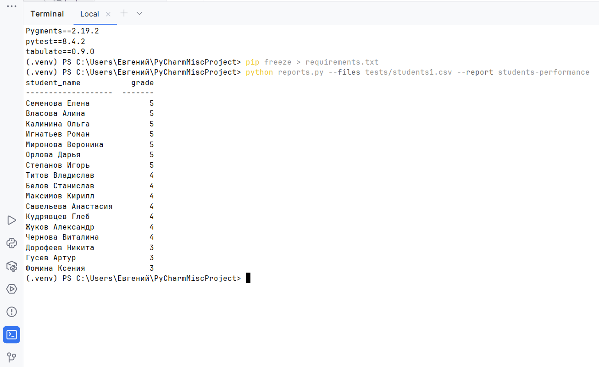
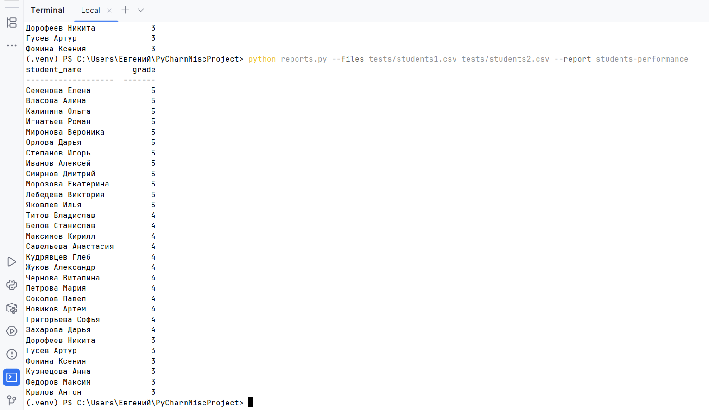

# Students_Reports
Скрипт читает файлы с данными в формате CSV об успеваемости студентов и формирует отчеты. Запуск скрипта производится из терминала. Архитектура позволяет масштабировать проект, добавляя новые отчеты в модуль.

Для запуска скрипта введите в консоли команду: 

python reports.py --files <путь к файлу> --report <название отчета>

Файлов для обработки может быть несколько.

Примеры запуска:

